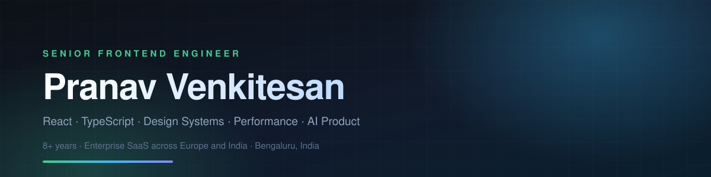

### Hi, I'm Pranav 👋

8+ years building scalable React and TypeScript applications for enterprise SaaS across Europe and India. I work at the intersection of design systems, performance engineering, accessibility, and AI-powered product features. Track record: Core Web Vitals improved 80%, manual workflows cut 60%, frontend standards and mentoring across multiple product teams.

---

### What I do

- **Design systems** — component libraries, design tokens, API design for components, versioning & documentation
- **Performance engineering** — Core Web Vitals, profiling, code splitting, lazy loading, bundle optimisation
- **Accessibility** — WCAG 2.1 AA, keyboard and screen-reader support, audits
- **AI product work** — LLM-backed features on OpenAI GPT APIs, prompt design
- **Technical leadership** — frontend architecture, engineering standards, developer experience, mentoring

---

## Experience

### Zenloop GmbH · Berlin, Germany
**Senior Frontend Engineer** · Jul 2022 – Present
Customer-experience analytics platform for Fortune 500 clients · React, TypeScript · three delivery squads

- Led frontend architecture, feature delivery and code review across three squads, refactoring core React and TypeScript modules and partnering with product, design and backend engineers to ship customer-facing analytics features
- Shipped an AI topic- and keyword-analysis system on OpenAI GPT APIs that cut manual analysis time by **60%**, enabling customer success teams to cover **3× more accounts** per month
- Improved UI performance **80%** through route-level code splitting, lazy loading and bundle optimisation, moving Core Web Vitals into top-quartile scores for the platform
- Built and maintained a **15+ module** React component library consumed by three squads, cutting average feature development time by **40%**
- Drove cross-team integration defects down **30%** by establishing the shared code review standard and running regular pair-programming sessions

### Mitsogo (Hexnode UEM) · India
**Senior Software Engineer, Front End** · Sep 2021 – Jun 2022

- Architected a **20+ component** UI toolkit adopted across 3 enterprise product lines, standardizing UI patterns between design and engineering
- Halved onboarding time for new frontend developers by authoring the team's coding standards and component documentation during rapid headcount growth
- Mentored 5 junior engineers on component architecture, testing and accessibility — 3 promoted within a year

**Software Engineer, Front End** · Jun 2019 – Sep 2021

- Cut deployment time from **2 hours to 20 minutes** by introducing TDD and automated CI/CD pipelines with Jest and Cypress
- Delivered WCAG 2.1-compliant, cross-browser responsive dashboards that qualified the product for accessibility-regulated markets
- Reduced post-launch bug reports **45%** by running stakeholder UI/UX validation sessions ahead of build

### Mediapp · India
**Junior Front-End Developer** · Sep 2017 – Aug 2018

- Delivered the admin panel for India's first B2B pharmaceutical platform — **10,000+ users** across **500+ pharmacies** on launch day
- Engineered Firebase-backed authentication with role-based access control (RBAC), keeping multi-tenant pharmacy data isolated
- Cut order processing time **35%** with real-time data grids and a task scheduler in Ember.js

---

## Open Source

### [Ember Elements](https://github.com/ember-elements/ember-elements) · Creator & Maintainer · 2021 – 2023

An open-source TypeScript component library for Ember.js, built on Blueprint and engineered for data-dense enterprise interfaces — accessible, reusable components with typed public APIs.

- Designed the component API surface and TypeScript types, authored the usage documentation, and ran the versioned npm release process end to end
- Grew to **56 GitHub stars** with adoption by several enterprise teams, supporting users through issue triage and community requests

🔗 [Docs & demo](https://ember-elements.github.io/ember-elements/) · [Storybook](https://64f3486d17c24063fe86105d-zslyevuhcj.chromatic.com/) · `TypeScript` `Ember.js` `Blueprint` `Storybook` `npm`

---

> [!TIP]
> **Every project below is live.** Client sites, product work and open-source tooling — built for speed, semantic HTML and strong Core Web Vitals.

### 🌐 Public repositories

| Project | What it is | Stack | Links |
|---|---|---|---|
| **KavalaTech** (Dubase Studio) | Full agency site for a web & mobile development studio in Bangalore & Kerala — services, projects, products and blog sections. | `HTML` `CSS` `JavaScript` | [Code](https://github.com/pranavvenkitesan/dubase-studio) · [Demo](https://pranavvenkitesan.github.io/dubase-studio/) |
| **OptiSpire** | SEO agency website template — conversion-focused landing structure, service pages and blog. | `HTML` `CSS` `JavaScript` | [Code](https://github.com/pranavvenkitesan/OptiSpire-SEO-agency-template) · [Demo](https://pranavvenkitesan.github.io/OptiSpire-SEO-agency-template/) |
| **Orivex** | Portfolio / studio website template with a project-led layout. | `HTML` `CSS` `JavaScript` | [Code](https://github.com/pranavvenkitesan/orivex-web) · [Demo](https://pranavvenkitesan.github.io/orivex-web/) |
| **Amaterasu Health** | Marketing site for a mental-health platform — a cognition lab working at the intersection of technology and nature. | `HTML` `CSS` `JavaScript` | [Code](https://github.com/pranavvenkitesan/amaterasu-health) · [Demo](https://pranavvenkitesan.github.io/amaterasu-health/) |
| **Liag** | Interior design studio site — editorial layout, image-led project showcase. | `HTML` `CSS` `JavaScript` | [Code](https://github.com/pranavvenkitesan/liag-interior-design-studio) |
| **Ember Elements** | Open-source TypeScript UI toolkit for Ember.js, built on Blueprint for data-dense enterprise interfaces. Typed public APIs, accessible components, versioned npm releases. | `TypeScript` `Ember.js` `Blueprint` `Storybook` | [Code](https://github.com/ember-elements/ember-elements) · [Demo](https://ember-elements.github.io/ember-elements/) |
| **Hydroflow** | Brand site for a beverage product — bold typography, single-scroll narrative. | `HTML` `CSS` | [Code](https://github.com/pranavvenkitesan/hydro-) · [Demo](https://pranavvenkitesan.github.io/hydro-/) |

### 🔒 Private work

> [!NOTE]
> Source is private (client and product work), but both are live — demos linked below.

| Project | What it is | Stack | Links |
|---|---|---|---|
| 🔒 **Tarabyaji** | Full-stack online jewellery store. Storefront with collections, variant swatches, wishlist, compare, cart with free-shipping thresholds and Razorpay checkout — plus a separate admin panel for catalogue, orders and analytics. | `Next.js` `React` `Redux Toolkit` `SCSS` `Express` `MongoDB` `JWT` `Razorpay` `Cloudinary` `Recharts` | [Live site](https://jewellery-online-store-fronend.vercel.app/) · Private repo |
| 🔒 **ReplyAI** | AI growth and communication platform for local businesses (a KavalaTech product). Replaces six disconnected tools with one workspace: AI-drafted Google review replies, WhatsApp enquiry threads, bookings, marketing content and local SEO monitoring — owner approves before anything publishes. | `React` `TypeScript` `Node.js` `OpenAI API` | [Product page](https://pranavvenkitesan.github.io/dubase-studio/products/replyai.html) · Private repo |

---

## Tech

**Languages & frontend**

**Mobile**

**Backend & data**

**Cloud & DevOps**

**Testing & tooling**

<b>Full skill breakdown</b>

 

| Area | |
|---|---|
| **Languages** | TypeScript, JavaScript (ES6+), HTML5, CSS3 |
| **Frontend** | React.js, React Hooks, custom hooks, Next.js, Ember.js, SPAs, component architecture, reusable components, responsive & data-dense UI |
| **Mobile** | React Native, Expo, cross-platform iOS & Android apps, app store release process |
| **Design Systems** | Component libraries, design tokens, API design for components, versioning & documentation |
| **State Management** | Redux, Zustand, MobX, React Context, Ember Data |
| **Styling** | Tailwind CSS, SCSS, CSS-in-JS, responsive layout |
| **AI & LLM** | OpenAI GPT APIs, prompt design, LLM-backed product features |
| **Backend & APIs** | Node.js, Express, RESTful APIs, authentication & RBAC, JWT, payment integration (Razorpay) |
| **Databases & BaaS** | MongoDB (Mongoose), PostgreSQL, Supabase, Firebase (Authentication, RBAC, real-time data) |
| **Cloud & DevOps** | AWS, Azure, Vercel, Docker, GitHub Actions, deployment pipelines |
| **Testing & Quality** | Jest, Cypress, QUnit, TDD, cross-browser testing, code review standards |
| **Performance** | Core Web Vitals, performance profiling, Lighthouse, code splitting, lazy loading, bundle optimisation |
| **Accessibility** | WCAG 2.1 AA, keyboard and screen-reader support, accessibility audits |
| **Tooling & CI/CD** | Git, Webpack, Vite, npm, ESLint, Prettier, Storybook, CI/CD pipelines, Figma |
| **Ways of Working** | Technical leadership, frontend architecture, engineering standards, developer experience, mentoring, cross-team collaboration, Agile |

---

<b>Education, achievements & publications</b>

 

**Education**
- **M.C.A.**, Computer Application · Amrita Vishwa Vidyapeetham, India · 2015 – 2017
- **B.C.A.**, Computer Application · Amrita Vishwa Vidyapeetham, India · 2012 – 2015

**Achievements**
- Top 30% nationally in the All India ICPC Spot Coding Competition among 5,000+ participants
- Advanced to elimination rounds of CodeChef SnackDown

**Publications**
- "3D Structural Prediction with Docking for Five Stages of Lymphoma" — IEEE International Conference
- "Comparative Sequence Analysis and 3D Structure Prediction Using Pairwise and Needleman-Wunsch" — IEEE International Conference
- "Novel Approach Using LCMSQ Algorithm for Identifying Lymphoma Stages" — International Journal of Pharma and Bio Sciences (IJPBS)

---

## Freelance & agency work

Alongside senior frontend roles, I take on end-to-end client work — design through deployment.

| | |
|---|---|
| **Full-stack web apps** | React and Next.js frontends on Node/Express APIs, with MongoDB, PostgreSQL or Supabase. Auth and RBAC, payment integrations, admin dashboards, file/media handling, deployment and CI. |
| **Mobile apps — iOS & Android** | Cross-platform apps in React Native and Expo, from product design through App Store and Play Store release. |
| **Marketing sites & templates** | Fast, SEO-friendly sites — semantic HTML, strong Core Web Vitals, responsive from the start. |
| **Design systems for teams** | Component libraries, design tokens and documentation so a growing team ships consistently. |
| **Performance & accessibility audits** | Core Web Vitals profiling, bundle analysis and WCAG 2.1 AA remediation on existing products. |

---

### Reach me

Open to senior and lead frontend roles, and to selected freelance work.
